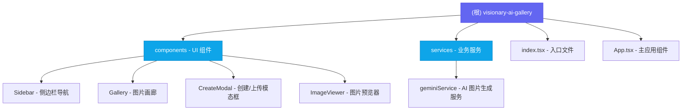

# Visionary AI Gallery - AI 绘图画廊应用

> 最后更新：2025-12-31 10:50:38

---

## 变更记录 (Changelog)

| 日期 | 变更内容 |
|------|---------|
| 2025-12-31 10:50:38 | 初始化项目 AI 上下文文档 |

---

## 项目愿景

**Visionary AI Gallery** 是一个基于 React 19 + Vite 的 AI 绘图画廊应用，集成了 Google Gemini 2.5 Flash Image API 进行图片生成。用户可以通过自然语言描述生成高质量 AI 图片，支持图片上传、分类浏览、预览和管理功能，提供沉浸式的画廊体验。

---

## 架构总览

### 技术栈
- **前端框架**: React 19.2.3 (使用 React 19 新特性)
- **构建工具**: Vite 6.2.0
- **语言**: TypeScript 5.8.2
- **样式**: Tailwind CSS (CDN) + 自定义 CSS
- **图标**: Lucide React 0.562.0
- **AI 服务**: Google Generative AI SDK (@google/genai 1.34.0)

### 应用特点
1. **单页应用 (SPA)**: 所有逻辑运行在浏览器端
2. **本地持久化**: 使用 localStorage 存储图片数据
3. **ESM 模块导入**: 使用 esm.sh CDN 加载 React 依赖
4. **响应式设计**: 支持桌面端和移动端布局
5. **分类管理**: 6 种预设图片分类（自然风景、人物角色、二次元、产品设计、商业海报、抽象艺术）

---

## 模块结构图



---

## 模块索引

| 模块路径 | 职责描述 | 语言 |
|---------|---------|------|
| `/` | 根目录，主应用入口 | TypeScript/TSX |
| `/components` | UI 组件目录 | TSX |
| `/services` | 业务服务目录 | TypeScript |

---

## 运行与开发

### 环境要求
- Node.js (推荐 v18+)
- npm / yarn / pnpm

### 快速启动

1. **安装依赖**
   ```bash
   npm install
   ```

2. **配置环境变量**
   - 创建 `.env.local` 文件
   - 设置 `GEMINI_API_KEY` 为你的 Gemini API 密钥

   ```env
   GEMINI_API_KEY=your_api_key_here
   ```

3. **启动开发服务器**
   ```bash
   npm run dev
   ```
   应用将在 http://localhost:3000 启动

4. **构建生产版本**
   ```bash
   npm run build
   ```

5. **预览生产构建**
   ```bash
   npm run preview
   ```

---

## 项目结构

```
visionary-ai-gallery/
├── index.html              # HTML 入口，包含 Tailwind CDN 和 ESM import map
├── index.tsx               # React 应用入口
├── App.tsx                 # 主应用组件，状态管理核心
├── types.ts                # TypeScript 类型定义
├── vite.config.ts          # Vite 配置
├── tsconfig.json           # TypeScript 配置
├── package.json            # 项目依赖配置
├── .env.local              # 环境变量 (需手动创建)
├── metadata.json           # 项目元数据
├── components/
│   ├── Sidebar.tsx         # 侧边栏分类导航
│   ├── Gallery.tsx         # 图片网格画廊
│   ├── CreateModal.tsx     # 创建/上传模态框
│   └── ImageViewer.tsx     # 图片详情预览
└── services/
    └── geminiService.ts    # Gemini AI 图片生成服务
```

---

## 数据模型

### GalleryItem
画廊中每一张图片的数据结构：
```typescript
interface GalleryItem {
  id: string;              // 唯一标识
  url: string;             // 图片 URL (支持 base64/data URI)
  prompt: string;          // 提示词描述
  category: Category;      // 分类枚举
  createdAt: number;       // 创建时间戳
  source: 'generated' | 'uploaded';  // 来源标记
}
```

### Category
图片分类枚举：
- `ALL` - 全部作品
- `LANDSCAPE` - 自然风景
- `CHARACTER` - 人物角色
- `ANIME` - 二次元/动漫
- `PRODUCT` - 产品设计
- `POSTER` - 商业海报
- `ABSTRACT` - 抽象艺术

### GenerationConfig
AI 生成配置：
```typescript
interface GenerationConfig {
  prompt: string;                    // 提示词
  category: Category;                // 分类（影响 prompt 增强）
  aspectRatio: "1:1" | "3:4" | "4:3" | "16:9" | "9:16";  // 图片比例
}
```

---

## 核心功能

### 1. AI 图片生成
- 通过 `geminiService.ts` 调用 Google Gemini 2.5 Flash Image API
- 根据分类自动增强提示词（Prompt Engineering）
- 支持多种图片比例（1:1, 16:9, 9:16）

### 2. 图片上传
- 支持本地上传图片到画廊
- 文件大小限制：4MB
- 支持预览后再确认保存

### 3. 分类浏览
- 侧边栏导航切换分类
- 响应式设计（移动端可折叠）

### 4. 图片管理
- 删除图片（带确认提示）
- 下载图片到本地
- 一键重置所有数据

### 5. 本地存储
- 使用 localStorage 持久化图片数据
- 容量超限处理与用户提示

---

## 编码规范

### TypeScript
- 使用函数式组件 + React.FC 类型
- Props 接口定义在组件文件顶部
- 使用枚举 (enum) 定义固定值集合

### 命名约定
- 组件文件：PascalCase (如 `Gallery.tsx`)
- 工具/服务文件：camelCase (如 `geminiService.ts`)
- 类型定义：PascalCase 接口/枚举 (如 `GalleryItem`, `Category`)

### 样式规范
- 使用 Tailwind CSS 工具类
- 颜色主题：Slate (背景) + Indigo (主色)
- 响应式断点：sm / lg / xl

---

## AI 使用指引

### 适合 AI 辅助的任务
1. **组件重构**: 优化组件结构、提取可复用逻辑
2. **样式调整**: Tailwind 样式微调、响应式布局改进
3. **功能扩展**: 添加新的图片分类、批量操作等
4. **性能优化**: 图片懒加载、虚拟滚动等

### 关键上下文
- **状态管理**: 当前使用 React useState，全部在 App.tsx 中
- **API 集成**: Gemini API 通过 `@google/genai` SDK 调用
- **存储策略**: localStorage，注意容量限制（通常 5-10MB）
- **模块导入**: 使用 ESM import map，React 从 CDN 加载

### 修改注意事项
1. 修改 `index.html` 的 import map 时需同步更新 `vite.config.ts` 的 alias
2. 新增分类需同步更新 `types.ts` 中的 `Category` 枚举和 `CategoryMap`
3. API Key 在运行时注入，通过 `process.env.API_KEY` 访问

---

## 常见问题

### Q: 为什么图片在刷新后消失？
A: localStorage 可能容量不足。删除部分图片或使用较小的图片可解决。

### Q: 如何更换 AI 模型？
A: 修改 `services/geminiService.ts` 中的 `model` 参数。

### Q: 支持哪些图片格式？
A: 生成图片为 PNG 格式；上传支持浏览器可识别的图片格式（PNG, JPG, GIF, WebP 等）。

---

## 外部链接

- [Vite 文档](https://vitejs.dev/)
- [React 19 文档](https://react.dev/)
- [Google Generative AI SDK](https://github.com/google/generative-ai-js)
- [Tailwind CSS](https://tailwindcss.com/)
- [Lucide Icons](https://lucide.dev/)
